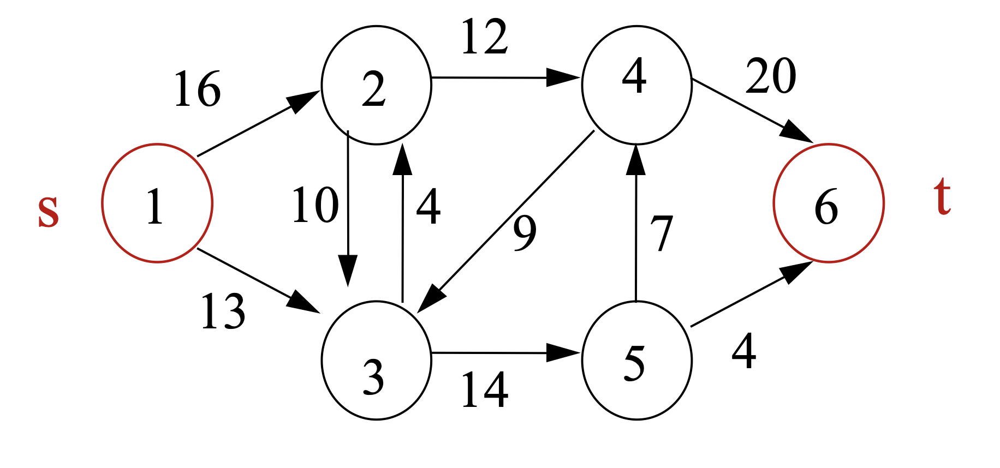

Algorithms final project:

The purpose of the project is to find the max-flow of a given graph using Ford–Fulkerson algorithm implemented in 2 ways.
The first option is an algorithm based on BFS.
The second option is a greedy algorithm that uses a version of Dijkstra algorithm.

For example:

The output will be:

BFS Method:

Max flow = 23.

Mincut:S=1,2,3,5. T=4,6.

Number of iterations = 3.

Greedy Method:

Max flow = 23.

MinCut:S=1,2,3,5. T=4,6.

Number of iterations = 4.
